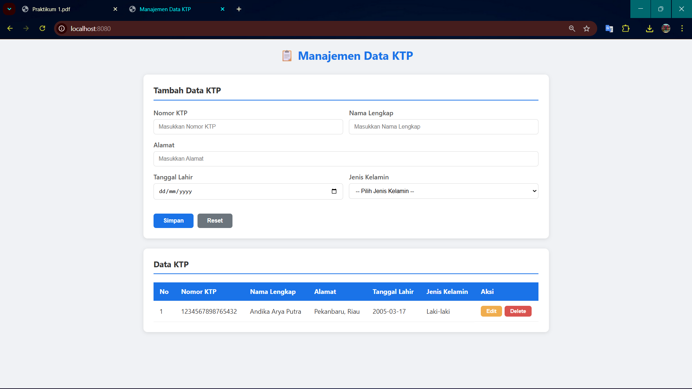

# Sistem Manajemen Data KTP

<p align="center">
  
</p>

Aplikasi web full-stack untuk mengelola data Kartu Tanda Penduduk (KTP) berbasis **Spring Boot** dan **MySQL**. Aplikasi ini menyediakan fitur CRUD (Create, Read, Update, Delete) lengkap dengan tampilan web interaktif menggunakan jQuery AJAX tanpa reload halaman.

Dibangun menggunakan arsitektur berlapis (*layered architecture*) yang bersih dan terstruktur: **Controller → Service → Repository**, dengan pemisahan antara Entity dan DTO melalui Mapper.

---

## Fitur Utama

- ✅ Menambahkan data KTP baru (Create)
- ✅ Menampilkan seluruh data KTP (Read)
- ✅ Menampilkan data KTP berdasarkan ID
- ✅ Mengubah data KTP (Update)
- ✅ Menghapus data KTP (Delete)
- ✅ Validasi input data (format Nomor KTP, kelengkapan field)
- ✅ Pencegahan duplikasi Nomor KTP
- ✅ Tampilan web interaktif tanpa reload halaman (AJAX)

---

## Teknologi yang Digunakan

| Komponen    | Teknologi                          |
| ----------- | ---------------------------------- |
| Backend     | Java, Spring Boot, Spring Data JPA |
| Database    | MySQL                              |
| Frontend    | HTML, CSS, JavaScript (jQuery)     |
| Build Tool  | Maven                              |
| Library     | Lombok                             |

---

## Struktur Database

Database: `spring`

Tabel: `ktp`

| Kolom           | Tipe Data | Keterangan                  |
| --------------- | --------- | --------------------------- |
| `id`            | INT       | Primary Key, Auto Increment |
| `nomor_ktp`     | VARCHAR   | Unique, 16 digit angka      |
| `nama_lengkap`  | VARCHAR   | Nama lengkap pemilik KTP    |
| `alamat`        | VARCHAR   | Alamat tempat tinggal       |
| `tanggal_lahir` | DATE      | Tanggal lahir               |
| `jenis_kelamin` | VARCHAR   | Laki-laki / Perempuan       |

---

## Dokumentasi API

Base URL: `http://localhost:8080`

| Method   | Endpoint    | Deskripsi                        |
| -------- | ----------- | -------------------------------- |
| `POST`   | `/ktp`      | Menambahkan data KTP baru        |
| `GET`    | `/ktp`      | Mengambil semua data KTP         |
| `GET`    | `/ktp/{id}` | Mengambil data KTP berdasarkan ID|
| `PUT`    | `/ktp/{id}` | Mengupdate data KTP              |
| `DELETE` | `/ktp/{id}` | Menghapus data KTP               |

### Contoh Request (POST `/ktp`)

```json
{
  "nomorKtp": "1234567890123456",
  "namaLengkap": "Andika Arya",
  "alamat": "Pekanbaru",
  "tanggalLahir": "2005-03-17",
  "jenisKelamin": "Laki-laki"
}
```

### Contoh Response (201 Created)

```json
{
  "id": 1,
  "nomorKtp": "1234567890123456",
  "namaLengkap": "Andika Arya",
  "alamat": "Pekanbaru",
  "tanggalLahir": "2005-03-17",
  "jenisKelamin": "Laki-laki"
}
```

### Contoh Response Error

```json
{
  "error": "Nomor KTP sudah ada"
}
```

---

## Struktur Project

```
com.example.demo
├── controller/         → Menangani request dan response API
│   └── KtpController.java
├── service/            → Logika bisnis aplikasi
│   ├── KtpService.java
│   └── impl/
│       └── KtpServiceImpl.java
├── repository/         → Akses dan query ke database
│   └── KtpRepository.java
├── model/
│   ├── entity/         → Representasi tabel database
│   │   └── Ktp.java
│   └── dto/            → Objek transfer data (Request & Response)
│       ├── KtpRequest.java
│       └── KtpResponse.java
├── mapper/             → Konversi antara DTO dan Entity
│   └── KtpMapper.java
├── util/               → Utilitas validasi data
│   └── ValidationUtil.java
└── DemoApplication.java
```

**Frontend:**

```
src/main/resources/static/
└── index.html          → Halaman web dengan form dan tabel data
```

---

## Cara Menjalankan Project

### Prasyarat

- Java 17 atau lebih baru
- MySQL Server
- Maven

### Langkah-langkah

1. **Buat database MySQL**

   ```sql
   CREATE DATABASE spring;
   ```

2. **Sesuaikan konfigurasi database**

   Edit file `.env` di root project:

   ```properties
   DATABASE_URL=jdbc:mysql://localhost:3306/spring?createDatabaseIfNotExist=true
   DATABASE_USERNAME=root
   DATABASE_PASSWORD=your_password
   ```

3. **Jalankan aplikasi**

   ```bash
   mvn spring-boot:run
   ```

4. **Buka browser**

   ```
   http://localhost:8080
   ```

   Tabel `ktp` akan dibuat secara otomatis oleh Hibernate (`ddl-auto=update`).

---

## Validasi Data

Aplikasi melakukan validasi terhadap setiap input data:

| Field           | Aturan Validasi                              |
| --------------- | -------------------------------------------- |
| `nomorKtp`      | Wajib diisi, hanya angka, harus 16 digit     |
| `namaLengkap`   | Wajib diisi                                  |
| `alamat`        | Wajib diisi                                  |
| `tanggalLahir`  | Wajib diisi                                  |
| `jenisKelamin`  | Wajib diisi                                  |

Jika Nomor KTP sudah terdaftar, sistem akan menolak data dengan pesan: **"Nomor KTP sudah ada"**.

---

## Catatan

- Project ini dibuat untuk keperluan **praktikum mata kuliah Deployment Perangkat Lunak**.
- Dapat dikembangkan lebih lanjut dengan fitur seperti:
  - Authentication & Authorization (Spring Security)
  - Pagination dan pencarian data
  - Export data ke PDF/Excel
  - Deployment ke cloud (AWS, Heroku, dll.)

---

## Penulis

**Andika Arya** — 20230140214
